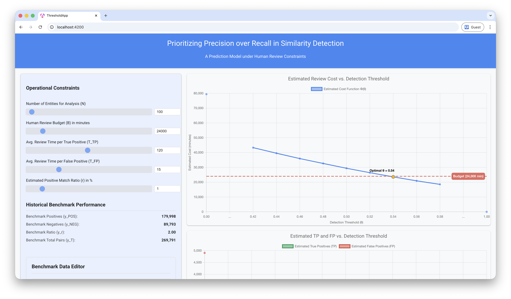
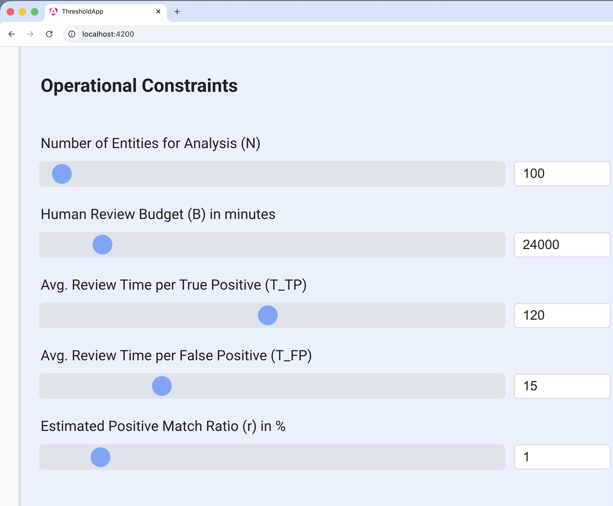
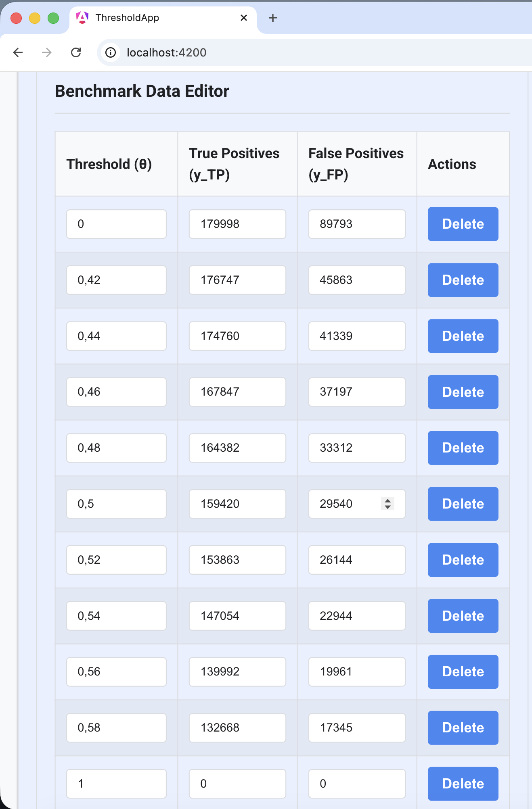
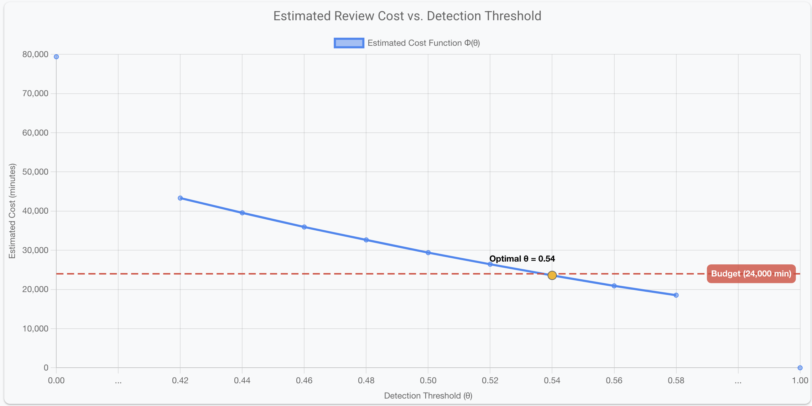
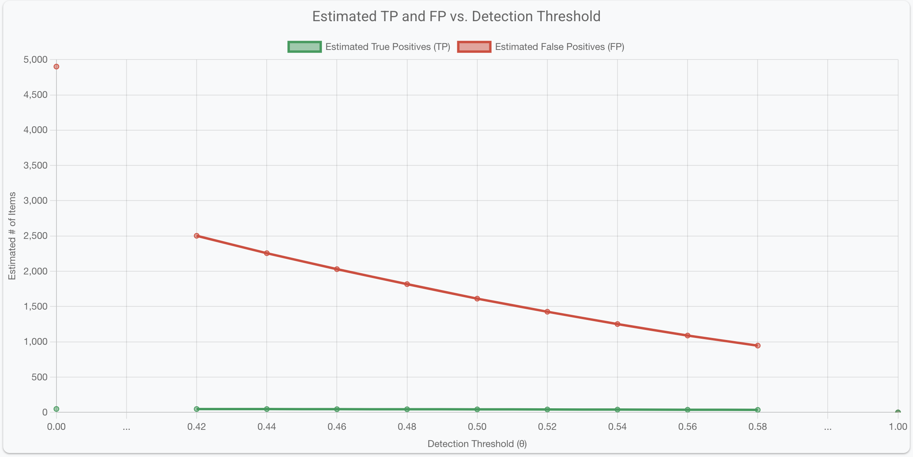
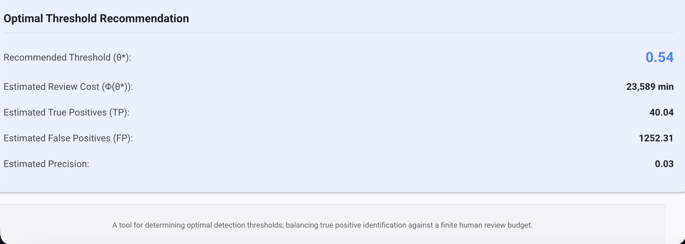

# threshold-ops
A model to determine the optimal detection thresholds, balancing the identification of true positives against a finite human review budget available.

## Getting Started

To get the application up and running, follow these steps:

1.  **Install Dependencies**: Navigate to the `threshold-app` directory and install the necessary Node.js dependencies.
    ```bash
    cd threshold-app
    npm install
    ```

2.  **Development Server**: Run `ng serve` for a development server.
    ```bash
    ng serve
    ```
    Navigate to `http://localhost:4200/` in your browser. The application will automatically reload if you change any of the source files.

## Screenshots

The following screenshots illustrate the application's functionality.

### Main Application View



### Parameters input



### Benchmark Data Editor



### Estimated review cost



### Estimated identified positives



### Tool recommendation


